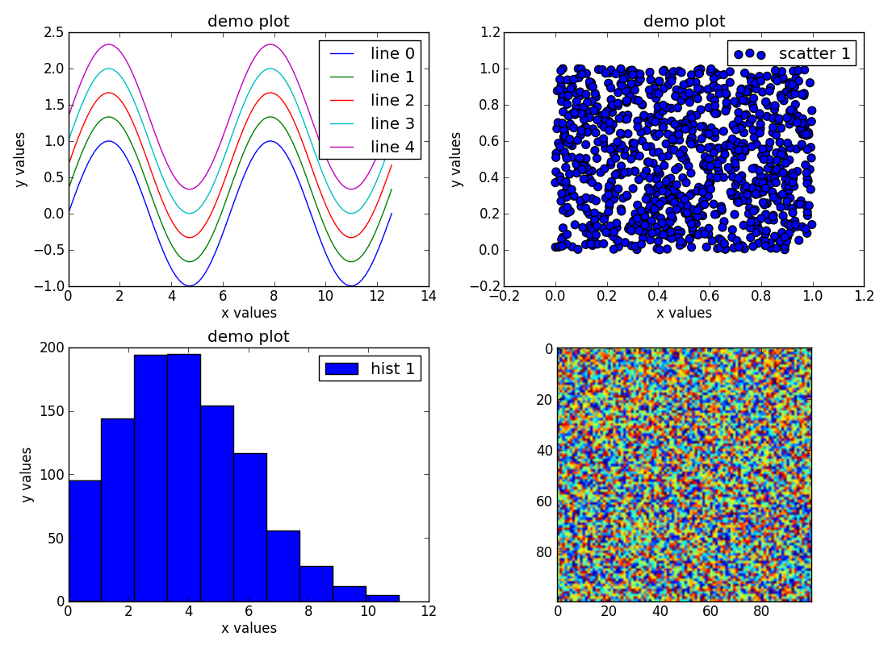
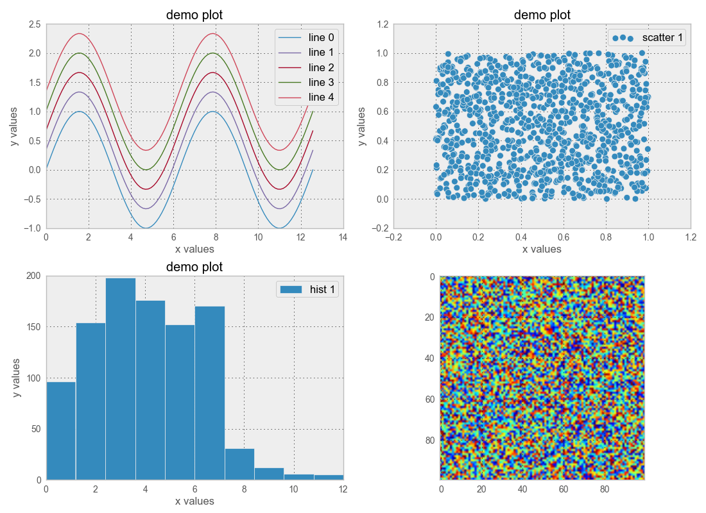
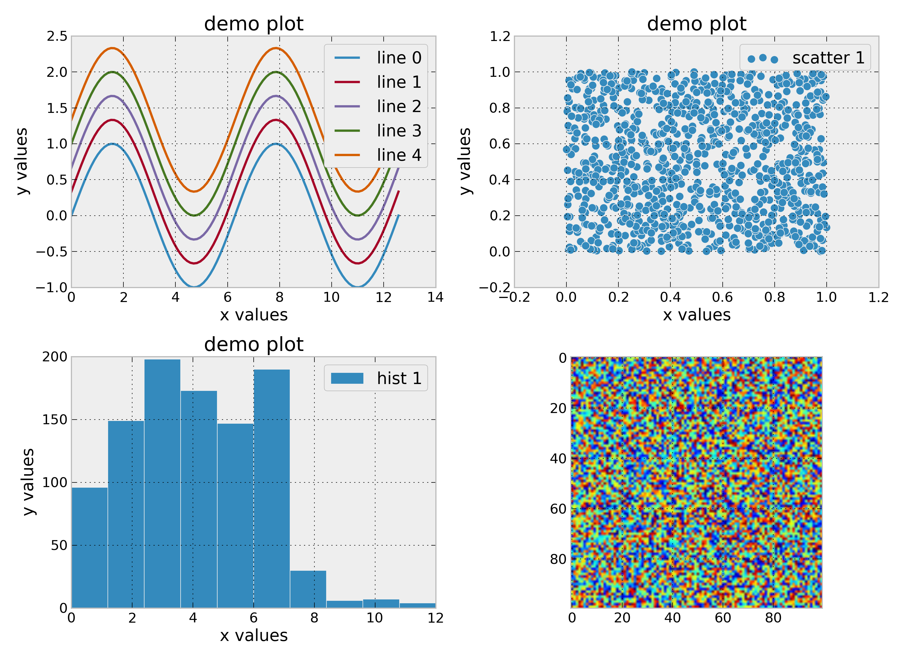
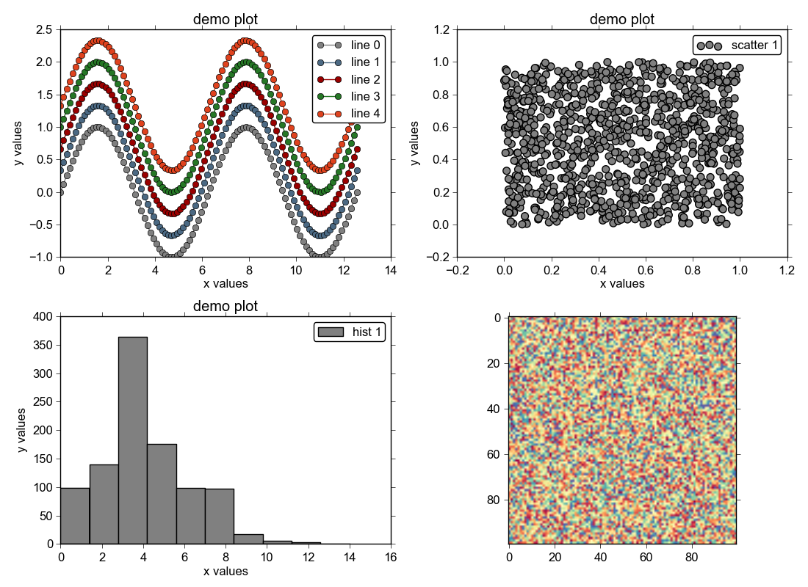

`matplotlibrc` demos
====================

Some -- but not all -- characteristics of matplotlib plots can be configured
via the matplotlib.rcParams dictionary.

Add a new matplotlibrc file to the `rc` dir, say `myrc`, and use::

    $ ./showstyle.py myrc

See the `showstyle.py` file for usage -- for example, note how `hist` and
`scatter` grab the first color in `rcParams['axes.color_cycle']` since there's
no way to set the default scatter or hist color via rcParams.

Screenshots
-----------

Some included styles are:

- default

- ggplotish

- probpro

- rlike

